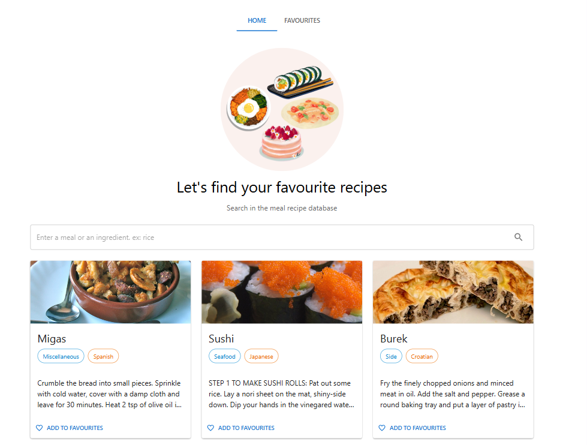
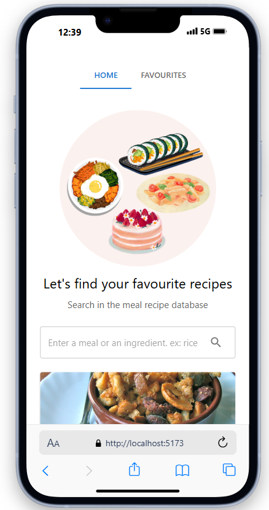
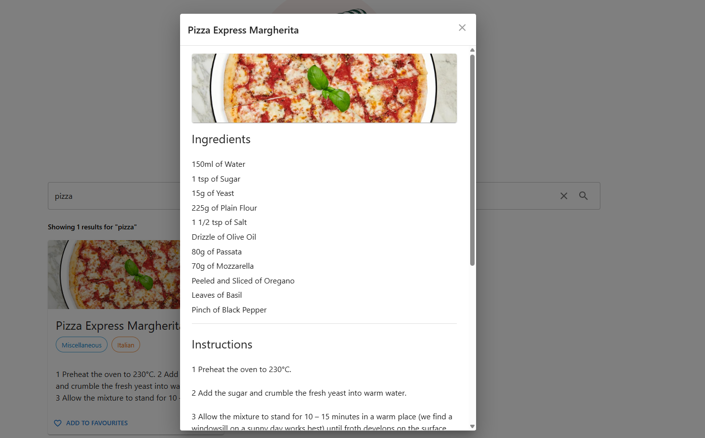
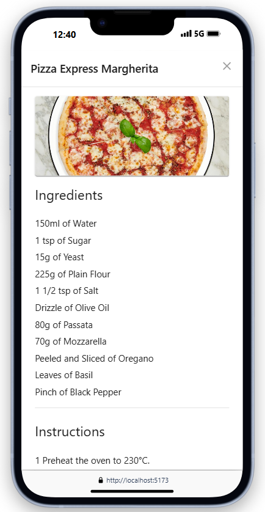
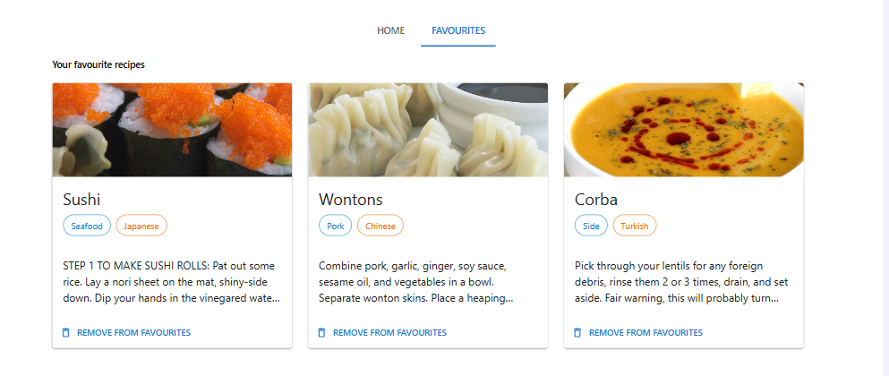
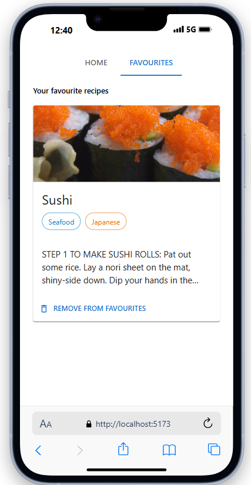
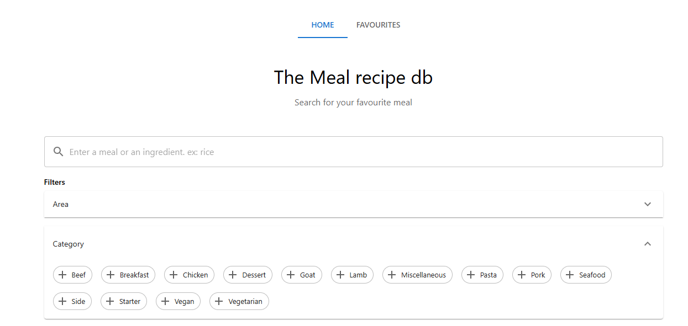

# The Meal recipe database App

This project allows you to look for your favourite recipes thanks to [TheMealDB API](https://www.themealdb.com/).

This project has been built for training to showcase usage of `React, Redux, Redux toolkit, Redux thunk and React router`.

### Look for a recipe


### Read recipe instructions


### Add a recipe to the favourites



## Installation and Setup Instructions

You will need `node` and `npm` installed globally on your machine.

### Prerequisites
Provide the `VITE_THE_MEAL_DB_API_URL` in  `.env`

```
VITE_THE_MEAL_DB_API_URL=https://www.themealdb.com/api
```

Installation:

`npm install`


To Start Server:

`npm run dev`

To Visit App:

`http://localhost:5173/`

To Test:
`npm run test`

## Future improvements
- Add Load More or Pagination to display limited amount of recipes
- Make filters work to narrow down the results
  
